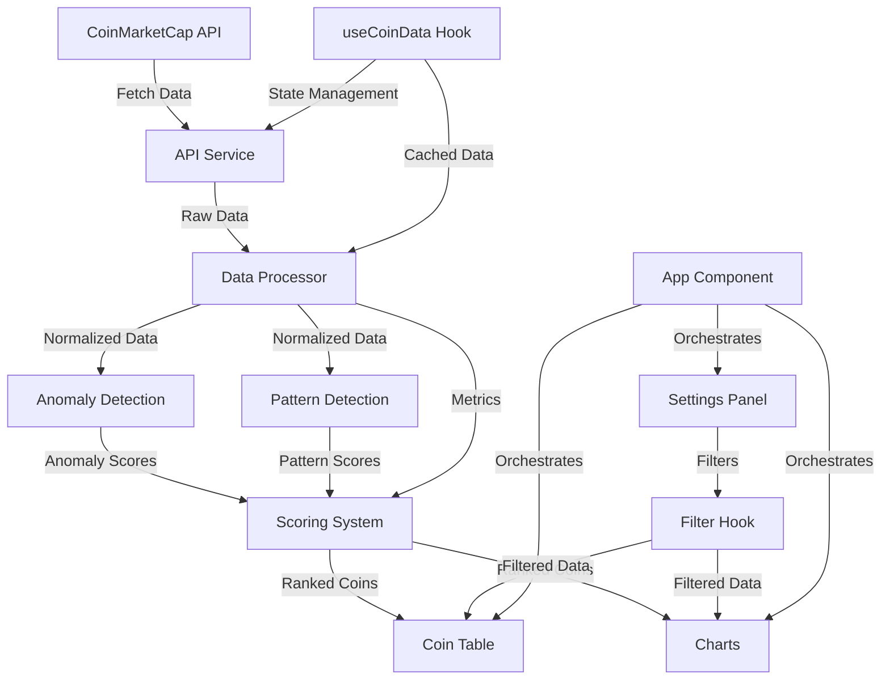
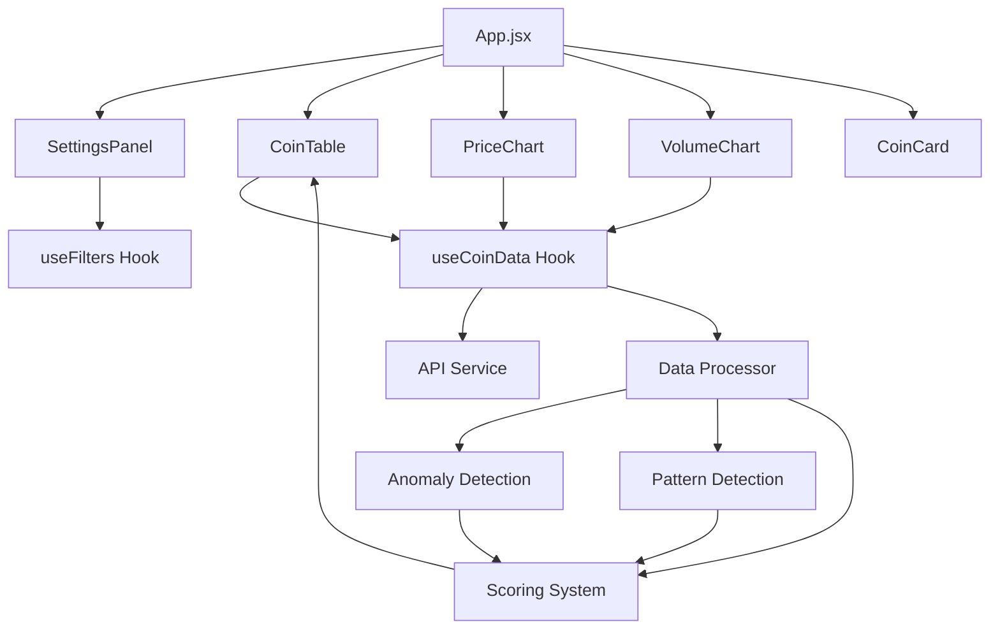
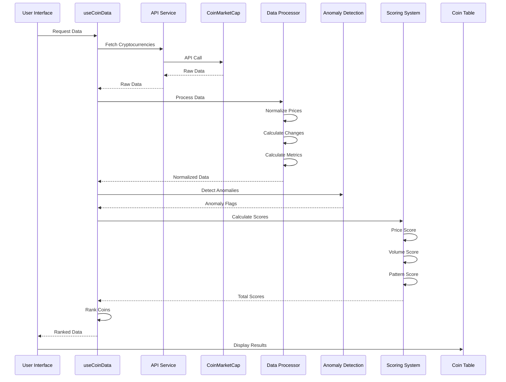
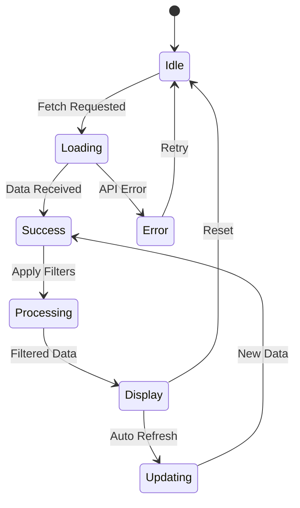
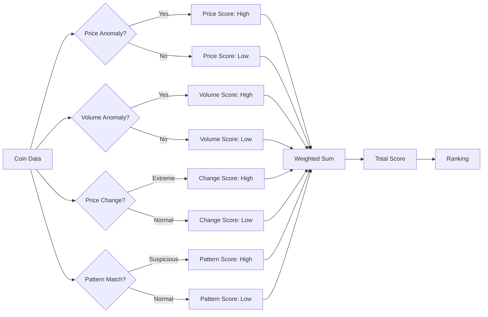

# معماری سیستم CoinFinder

## نمودار جریان داده

```mermaid
flowchart TD
    A[CoinMarketCap API] -->|Fetch Data| B[API Service]
    B -->|Raw Data| C[Data Processor]
    C -->|Normalized Data| D[Anomaly Detection]
    C -->|Normalized Data| E[Pattern Detection]
    D -->|Anomaly Scores| F[Scoring System]
    E -->|Pattern Scores| F
    C -->|Metrics| F
    F -->|Ranked Coins| G[Coin Table]
    F -->|Ranked Coins| H[Charts]
    I[Settings Panel] -->|Filters| J[Filter Hook]
    J -->|Filtered Data| G
    J -->|Filtered Data| H
    K[useCoinData Hook] -->|State Management| B
    K -->|Cached Data| C
    L[App Component] -->|Orchestrates| G
    L -->|Orchestrates| H
    L -->|Orchestrates| I
```

## نمودار کامپوننت‌ها

```mermaid
graph TB
    App[App.jsx] --> Settings[SettingsPanel]
    App --> Table[CoinTable]
    App --> PriceChart[PriceChart]
    App --> VolumeChart[VolumeChart]
    App --> CoinCard[CoinCard]
    
    Settings --> Filters[useFilters Hook]
    Table --> CoinData[useCoinData Hook]
    PriceChart --> CoinData
    VolumeChart --> CoinData
    
    CoinData --> API[API Service]
    CoinData --> Processor[Data Processor]
    
    Processor --> Anomaly[Anomaly Detection]
    Processor --> Pattern[Pattern Detection]
    Processor --> Scoring[Scoring System]
    
    Scoring --> Table
    Anomaly --> Scoring
    Pattern --> Scoring
```

## جریان پردازش داده

```mermaid
sequenceDiagram
    participant UI as User Interface
    participant Hook as useCoinData
    participant API as API Service
    participant CMC as CoinMarketCap
    participant Proc as Data Processor
    participant Anomaly as Anomaly Detection
    participant Score as Scoring System
    participant Table as Coin Table

    UI->>Hook: Request Data
    Hook->>API: Fetch Cryptocurrencies
    API->>CMC: API Call
    CMC-->>API: Raw Data
    API-->>Hook: Raw Data
    Hook->>Proc: Process Data
    Proc->>Proc: Normalize Prices
    Proc->>Proc: Calculate Changes
    Proc->>Proc: Calculate Metrics
    Proc-->>Hook: Normalized Data
    Hook->>Anomaly: Detect Anomalies
    Anomaly-->>Hook: Anomaly Flags
    Hook->>Score: Calculate Scores
    Score->>Score: Price Score
    Score->>Score: Volume Score
    Score->>Score: Pattern Score
    Score-->>Hook: Total Scores
    Hook->>Hook: Rank Coins
    Hook-->>UI: Ranked Data
    UI->>Table: Display Results
```

## ساختار State Management

```mermaid
stateDiagram-v2
    [*] --> Idle
    Idle --> Loading: Fetch Requested
    Loading --> Success: Data Received
    Loading --> Error: API Error
    Success --> Processing: Apply Filters
    Processing --> Display: Filtered Data
    Display --> Updating: Auto Refresh
    Updating --> Success: New Data
    Error --> Idle: Retry
    Display --> Idle: Reset
```

## الگوریتم امتیازدهی

```mermaid
flowchart LR
    A[Coin Data] --> B{Price Anomaly?}
    A --> C{Volume Anomaly?}
    A --> D{Price Change?}
    A --> E{Pattern Match?}
    
    B -->|Yes| F[Price Score: High]
    B -->|No| G[Price Score: Low]
    
    C -->|Yes| H[Volume Score: High]
    C -->|No| I[Volume Score: Low]
    
    D -->|Extreme| J[Change Score: High]
    D -->|Normal| K[Change Score: Low]
    
    E -->|Suspicious| L[Pattern Score: High]
    E -->|Normal| M[Pattern Score: Low]
    
    F --> N[Weighted Sum]
    G --> N
    H --> N
    I --> N
    J --> N
    K --> N
    L --> N
    M --> N
    
    N --> O[Total Score]
    O --> P[Ranking]
```

